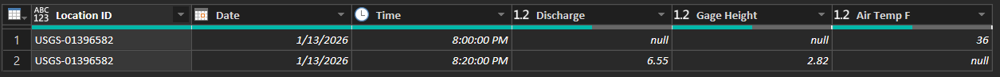
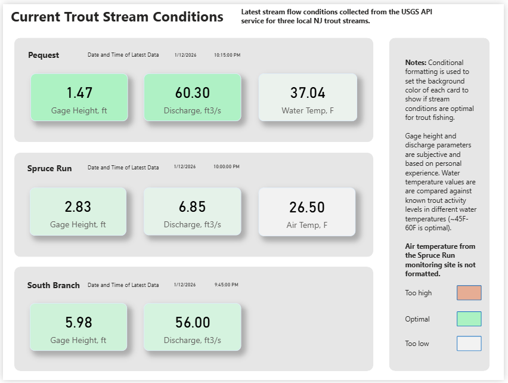

# 🎣 NJ Stream Conditions Dashboard (USGS API)

This project is a personal data analytics project built around a hobby of mine: **fly fishing**. Before heading out, I regularly check stream conditions such as streamflow and gauge height to determine whether conditions are safe and fishable. This dashboard simplifies that process by pulling **near real-time data from the USGS Water Services API** and presenting current conditions for select streams in New Jersey.

---

## 📌 Project Overview

The dashboard displays current stream conditions for **three New Jersey streams** using publicly available USGS data. The project demonstrates a simple, end-to-end BI workflow:

**USGS API → Power Query (ETL) → Power BI Dashboard**

The focus is on clean data ingestion, repeatable transformations, and clear visual design for quick decision-making.

---

## 🎯 Purpose of the Project

This project serves two goals:

1. **Personal Use** – Quickly assess stream conditions before fly fishing outings  
2. **Portfolio Demonstration** – Showcase practical BI skills using a real-world public API

The project mirrors common operational dashboards used in enterprise settings: current-state monitoring, standardized transformations, and refreshable data models.

---

## 🛠️ Tools & Technologies

- **Data Source:** USGS Water Services API  
- **ETL / Data Transformation:** Power Query  
- **Data Modeling & Visualization:** Power BI  
- **Concepts Demonstrated:**
  - API-based data ingestion
  - Power Query transformations and normalization
  - BI modeling and dashboard design

---

## 🧱 Dashboard Build Process

This section outlines the high-level steps used to build the dashboard.

### 1. Data Ingestion
- Connected to the USGS Water Services API using Power Query
- Parsed JSON responses into tabular format and removed unnecessary elements
  

### 2. Data Transformation (Power Query)
- Pivoted columns
- Changed timestamps to EST and separated into separate date and time columns
- Renamed columns and changed data types
- **Note:** Air temperature is recorded at a slightly different time than flow conditions.
  

### 3. Dashboard Design (Power BI)
- Designed visuals for quick “at-a-glance” assessment
- Used scales and conditional formatting for each stream measurement based on personal experience
  

---

## 📊 Dashboard Features

- Current streamflow and gauge height by river
- Timestamp of the most recent USGS reading
- At-a-glance comparison across rivers
- Clean, minimal layout optimized for fast condition checks

---


## 🗂️ Repository Structure

```text
/
├── powerquery/           # Power Query (M) scripts for API ingestion and ETL
├── powerbi/              # Power BI dashboard files
├── docs/                 # Screenshots
└── README.md
